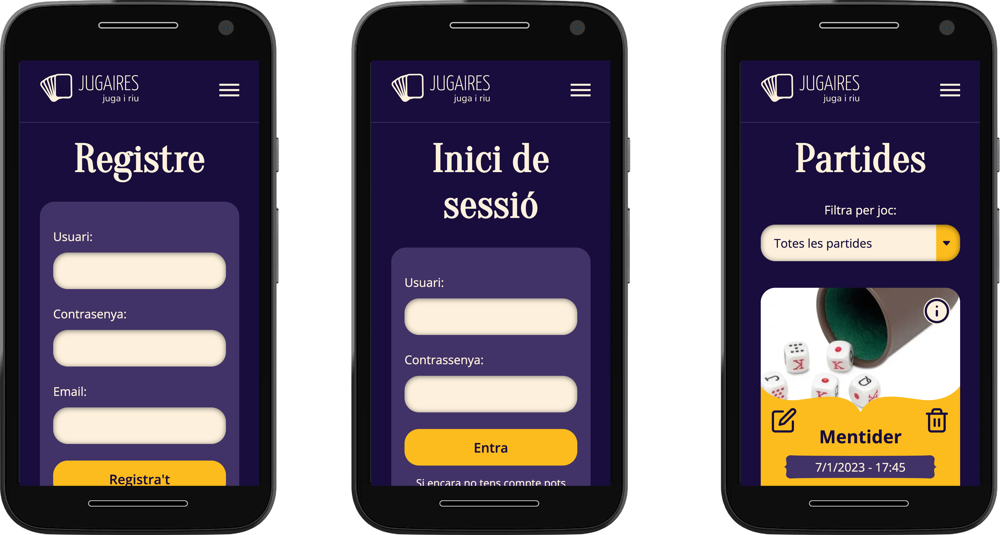
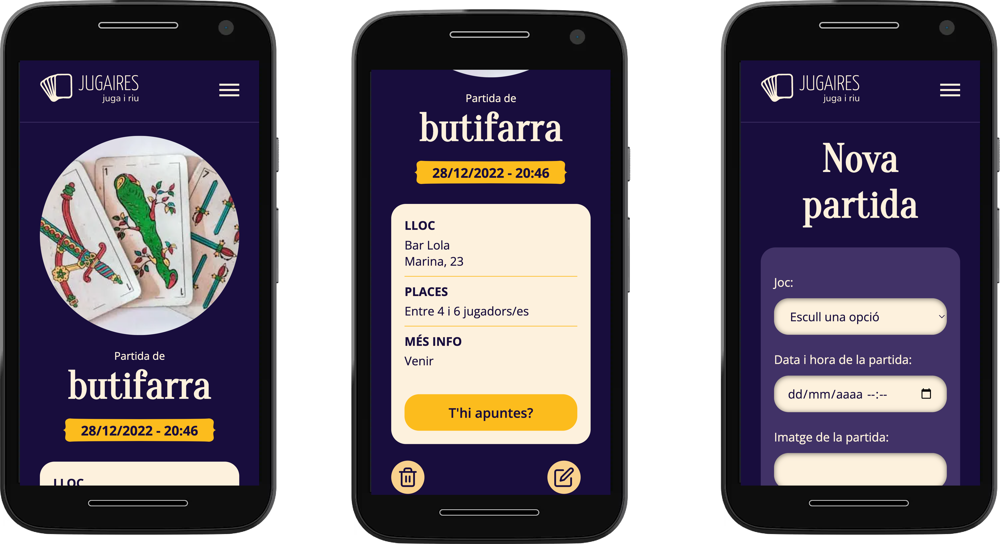

# Jugaires

> This is an app to share game board games in dates and places when and where different people can go, done in MERN stack + typescript.
> Live demo [_here_](https://nuria-ramoneda-final-project-202209.netlify.app/)

## Table of Contents

- [General Info](#general-information)
- [Technologies Used](#technologies-used)
- [Features](#features)
- [Screenshots](#screenshots)
- [Setup](#setup)
- [Api endpoints](#api-endpoints)
- [Query params](#query-params)
- [Project Status](#project-status)
- [Room for Improvement](#room-for-improvement)
- [Acknowledgements](#acknowledgements)
- [Contact](#contact)

## General Information

- This is the final project of Isdi Coders Full Stack Bootcamp Fall 2022. It is not finished but it has a lot of things done.

- With this app I want to connect people that love to play classics cards games, like Canasta or Podrida or Brisca or Continental, or that love to play lier dices or any other classic game board with more people around a table.

- I'm a lover of classic game cards and usually I don't have people with who play, it's not easy to find the moment with the friends that like it, so I thought that an application like this could help.

## Technologies Used

### Frontend

- React JS
- Typescript
- Redux
- Axios
- StyledComponents
- Eslint
- Husky
- Github actions
- SonarCloud
- Netlify (hosting front)
- Figma (design)

### Backend

- Node
- Express
- Express validation
- Mongoose
- Morgan
- Jsonwebtoken
- Bcrypt
- Chalk
- Cors
- Debug
- Render (hosting back)
- Supabase (hosting images)

### Testing

- Jest
- testing-library
- msw
- faker
- fishery
- supertest (only back)
- mongodb-memory-server (only back)

## Features

- Register new users
- Login User, not yet persistently
- Create new games, with the date when it will be, the place, players and image.
- Load all the games in the database and see first the last in the future.
- Filter the games by game board, if you are a fan only of one game board, then you can search for the games of this kind only and see the dates.
- Delete games. At this moment, anyone can delete any game, but in the future, only the owners will.

## Api Endpoints

- "/games": load all games
- "/game/:id": load only the game with the id received
- "/delete/:id": remove the game with the id received
- "/create": create a new game

## Query params

At this moments only are acceptable two query params: page and gameBoard. First is, of course, for pagination, and it will be mandatory from now on. The second is optional and only will be used if the user is filtering the list.

## Screenshots





<!-- If you have screenshots you'd like to share, include them here. -->

## Setup

You need to clone the Jugaires repository and install the dependencies with npm install.

```
# clone this reposritory
$ git clone https://github.com/isdi-coders-2022/Nuria-Ramoneda_Front-Final-Project-202209-BCN.git

# go into the repository & install dependencies
$ npm install

# run the app
$ npm start
```

## Project Status

The project is: _in progress_

## Room for Improvement

Room for improvement:

- Add alt text field for images
- Selects dropdown styling

To do:

- Finish CRUD with update screen.
- Protect routes to make public & private list
- Make owners of games the only with rights to delete or edit games.
- Show on public list less information about every game
- Add appointment functionality to the games, and control of how many people is going and how many places are still available.
- Finish desktop responsive implementation
- The footer

## Acknowledgements

This project is based on everything learned during the three months of the Isdi Coders bootcamp, so I must thank Mario González for his great teaching work. The assistant professors of the course David, Adrià have also contributed their grain of sand, and also Lorena who has contributed a mountain more than a grain ;). And to all the colleagues in the bootcamp, because we have brought it all together. Thanks to all.

## Contact

Created by @nuriarai
